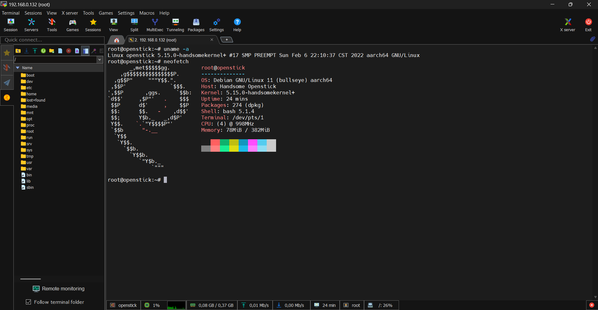

# OpenStick (MSM8916) — Full Installation via WSL2

Device: UZ801 / OpenStick (Qualcomm Snapdragon 410 / MSM8916)  
OS Target: Debian/Linux on OpenStick  
Host: Windows 11 + WSL2 (Ubuntu)  
Tool: ADB via USB passthrough (usbipd)

---

## Prerequisites

Complete the setup from `MSM8916_WSL_ADB_HOW_TO.md` first:

- WSL2 installed
- usbipd-win installed
- ADB detected in WSL: `adb devices` shows `0123456789ABCDEF  device`

---

## Step 1 — Install ADB & Fastboot inside WSL

```bash
sudo -s
apt install android-tools-adb android-tools-fastboot -y
adb start-server
```

## Step 2 — Reboot device into bootloader (fastboot mode)

```bash
adb reboot bootloader
```

> **Important:** The USB device will disconnect when the modem reboots into fastboot mode. You MUST re-run `usbipd attach` after this step.

## Step 3 — Re-attach USB device to WSL (fastboot mode)

In **Windows PowerShell (Administrator)**:
```powershell
usbipd list
```

You should see the device with a different VID:PID (fastboot mode):
```
3-1    18d1:d001  Android, ...                              Shared
```

Attach it to WSL:
```powershell
usbipd attach --busid 3-1 --wsl
```

Back in WSL, verify:
```bash
fastboot devices
```
Expected output:
```
16159ce0         fastboot
```

## Step 4 — Download base-generic image

```bash
wget https://github.com/OpenStick/OpenStick/releases/download/v1/base-generic.zip
unzip base-generic.zip
cd base/
```

## Step 5 — Flash base-generic image

```bash
./flash.sh
```

Output:
```
< waiting for any device >
```

The device will reboot again (back to Android/RNDIS mode). Re-attach USB to WSL:

In **Windows PowerShell (Administrator)**:
```powershell
usbipd list
usbipd attach --busid 3-1 --wsl
```

Back in WSL, `./flash.sh` will continue automatically:
```
Erasing 'boot'                                     OKAY [  0.120s]
Finished. Total time: 0.128s
Warning: skip copying aboot image avb footer (aboot partition size: 0, aboot image size: 287488).
Sending 'aboot' (280 KB)                           OKAY [  0.040s]
Writing 'aboot'                                    OKAY [  0.034s]
Finished. Total time: 0.103s
Rebooting                                          OKAY [  0.006s]
Finished. Total time: 0.057s
< waiting for any device >
```

Re-attach USB again (device reboots into fastboot a second time):
```powershell
usbipd attach --busid 3-1 --wsl
```

Flash continues:
```
Warning: skip copying partition image avb footer (partition partition size: 0, partition image size: 34304).
Sending 'partition' (33 KB)                        OKAY [  0.010s]
Writing 'partition'                                OKAY [  1.374s]
Finished. Total time: 1.412s
Sending 'hyp' (12 KB)                              OKAY [  0.006s]
Writing 'hyp'                                      OKAY [  0.005s]
Finished. Total time: 0.039s
Sending 'rpm' (512 KB)                             OKAY [  0.056s]
Writing 'rpm'                                      OKAY [  0.056s]
Finished. Total time: 0.133s
Sending 'sbl1' (512 KB)                            OKAY [  0.064s]
Writing 'sbl1'                                     OKAY [  0.056s]
Finished. Total time: 0.141s
Warning: skip copying tz image avb footer (tz partition size: 524288, tz image size: 605312).
Sending 'tz' (591 KB)                              OKAY [  0.108s]
Writing 'tz'                                       OKAY [  0.065s]
Finished. Total time: 0.201s
Sending 'fsc' (1 KB)                               OKAY [  0.008s]
Writing 'fsc'                                      OKAY [  0.006s]
Finished. Total time: 0.043s
Sending 'fsg' (1536 KB)                            OKAY [  0.276s]
Writing 'fsg'                                      OKAY [  0.155s]
Finished. Total time: 0.462s
Sending 'modemst1' (1536 KB)                       OKAY [  0.243s]
Writing 'modemst1'                                 OKAY [  0.169s]
Finished. Total time: 0.450s
Sending 'modemst2' (1536 KB)                       OKAY [  0.262s]
Writing 'modemst2'                                 OKAY [  0.156s]
Finished. Total time: 0.457s
Sending 'aboot' (280 KB)                           OKAY [  0.040s]
Writing 'aboot'                                    OKAY [  0.032s]
Finished. Total time: 0.134s
Warning: skip copying cdt image avb footer (cdt partition size: 0, cdt image size: 420).
Sending 'cdt' (0 KB)                               OKAY [  0.008s]
Writing 'cdt'                                      OKAY [  0.006s]
Finished. Total time: 0.048s
Erasing 'boot'                                     OKAY [  0.024s]
Finished. Total time: 0.033s
Erasing 'rootfs'                                   OKAY [  0.161s]
Finished. Total time: 0.170s
Rebooting                                          OKAY [  0.006s]
Finished. Total time: 0.057s
all done please flash your os!
```

> `all done please flash your os!` — base-generic flash is complete.

## Step 6 — Flash Debian image

Exit the `base/` folder and download the Debian image:
```bash
cd ../
wget https://github.com/OpenStick/OpenStick/releases/download/v1/debian.zip
unzip debian.zip
cd debian/
```

Run the flash script:
```bash
./flash.sh
```

Output:
```
< waiting for any device >
```

Re-attach USB to WSL (device enters fastboot mode again):
```powershell
usbipd attach --busid 3-1 --wsl
```

Flash continues — this takes several minutes:
```
Warning: skip copying rootfs image avb footer (rootfs partition size: 3571432960, rootfs image size: 140729801803440).
Sending sparse 'rootfs' 1/5 (203958 KB)            OKAY [ 23.952s]
Writing 'rootfs'                                   OKAY [ 67.524s]
Sending sparse 'rootfs' 2/5 (197981 KB)            OKAY [ 22.692s]
Writing 'rootfs'                                   OKAY [ 21.709s]
Sending sparse 'rootfs' 3/5 (204797 KB)            OKAY [ 24.209s]
Writing 'rootfs'                                   OKAY [ 22.462s]
Sending sparse 'rootfs' 4/5 (204552 KB)            OKAY [ 23.796s]
Writing 'rootfs'                                   OKAY [ 21.434s]
Sending sparse 'rootfs' 5/5 (86909 KB)             OKAY [ 10.014s]
Writing 'rootfs'                                   OKAY [ 71.638s]
Finished. Total time: 309.955s
Sending 'boot' (13270 KB)                          OKAY [  1.654s]
Writing 'boot'                                     OKAY [  1.362s]
Finished. Total time: 4.541s
Rebooting                                          OKAY [  0.006s]
Finished. Total time: 0.057s
```

## Step 7 — ADB connection issue after flash

After the flash completes, try connecting via WSL ADB:
```bash
adb shell
```
Output:
```
adb: no devices/emulators found
```

Check USB status in Windows:
```powershell
usbipd list
```
You may see the device as `Shared` with VID `18d1:d001` (ADB/fastboot mode), but WSL cannot attach it:
```powershell
usbipd attach --busid 3-1 --wsl
```
Output:
```
usbipd: info: Using WSL distribution 'Ubuntu' to attach; the device will be available in all WSL 2 distributions.
usbipd: info: Detected networking mode 'nat'.
usbipd: info: Using IP address 172.20.128.1 to reach the host.
WSL usbip: error: Attach Request for 3-1 failed - Device busy (exported)
usbipd: warning: The device appears to be used by Windows; stop the software using the device, or bind the device using the '--force' option.
usbipd: error: Failed to attach device with busid '3-1'.
```

Check what's holding the device:
```powershell
Get-Process adb -ErrorAction SilentlyContinue | Select-Object Id, ProcessName
```
Output:
```
   Id ProcessName
   -- -----------
21648 adb
```

Killing this process will cause the USB device to disappear completely:
```powershell
Get-Process adb -ErrorAction SilentlyContinue | Stop-Process -Force
```
```powershell
usbipd list
```
Device `3-1` is now gone from the list.

## Step 8 — Connect via Windows-side ADB instead

The Windows-side `adb.exe` can still communicate with the device. Navigate to the `base/` folder where `adb.exe` resides.

> **Note:** `<OPENSTICK_DIR>` is the path inside WSL where you extracted the zip files. If you downloaded to `/home/<user>/OpenStick`, use that path. Windows paths like `C:\D\MY\DEV\OpenStick` map to `/mnt/d/MY/DEV/OpenStick` in WSL.

```powershell
cd <OPENSTICK_DIR>/base
.\adb.exe shell
```

You are now inside the OpenStick shell:
```
root@openstick:/# uname -a
Linux openstick 5.15.0-handsomekernel+ #17 SMP PREEMPT Sun Feb 6 22:10:37 CST 2022 aarch64 GNU/Linux

root@openstick:/# lscpu
Architecture:                    aarch64
CPU op-mode(s):                  32-bit, 64-bit
Byte Order:                      Little Endian
CPU(s):                          4
On-line CPU(s) list:             0-3
Thread(s) per core:              1
Core(s) per socket:              4
Socket(s):                       1
Vendor ID:                       ARM
Model name:                      Cortex-A53
CPU max MHz:                     998.4000
CPU min MHz:                     200.0000
BogoMIPS:                        38.40
Flags:                           fp asimd evtstrm crc32 cpuid

root@openstick:/# free -h
               total        used        free      shared  buff/cache   available
Mem:           382Mi        63Mi       192Mi       1.0Mi       125Mi       307Mi
Swap:          191Mi          0B       191Mi

root@openstick:/# df -h
Filesystem       Size  Used Avail Use% Mounted on
udev             172M     0  172M   0% /dev
tmpfs             39M  1.2M   38M   4% /run
/dev/mmcblk0p14  3.3G  552M  2.6G  18% /
tmpfs            192M     0  192M   0% /dev/shm
tmpfs            5.0M     0  5.0M   0% /run/lock
```

## Step 9 — Connect to WiFi using nmtui

Set the terminal variable and launch nmtui:
```bash
export TERM=linux
nmtui
```

In the nmtui interface:
1. Select **Edit a connection**
2. Select **Add**
3. Choose **Wi-Fi**
4. Enter your SSID and password
5. Select **OK** → **Quit**

The device should now be connected to your WiFi network.

Verify the connection:
```bash
ifconfig
```
Expected output:
```
lo: flags=73<UP,LOOPBACK,RUNNING>  mtu 65536
        inet 127.0.0.1  netmask 255.0.0.0
        ...

usb0: flags=4163<UP,BROADCAST,RUNNING,MULTICAST>  mtu 1500
        inet 192.168.68.1  netmask 255.255.0.0  broadcast 192.168.255.255
        ...

wlan0: flags=4163<UP,BROADCAST,RUNNING,MULTICAST>  mtu 1500
        inet 192.168.0.132  netmask 255.255.255.0  broadcast 192.168.0.255
        ...
```

Your OpenStick now has a WiFi IP (use the IP shown by `ifconfig` — in this example it's `192.168.0.132`, but yours may differ depending on your router's DHCP assignment).

## Step 10 — Configure SSH access

First, disable the Mobian repo (it causes `apt update` to fail):
```bash
mv /etc/apt/sources.list.d/mobian.list /etc/apt/sources.list.d/mobian.list.disabled
```

Install nano:
```bash
sudo apt-get update
sudo apt-get install nano
```

Edit SSH config:
```bash
sudo nano /etc/ssh/sshd_config
```

Change these two lines:
```
PermitRootLogin no   →   PermitRootLogin yes
PasswordAuthentication no  →  PasswordAuthentication yes
```

Save (`Ctrl+O`, Enter) and exit (`Ctrl+X`).

Set a root password:
```bash
passwd
```
```
New password:
Retype new password:
passwd: password updated successfully
```

## Step 11 — SSH into OpenStick over WiFi

From your Windows PC:
```powershell
ssh root@<your_openstick_ip>
```

Voila — you are now connected to your OpenStick via SSH over WiFi! 🎉



---

## Summary: USB Re-attach Checklist

The device reboots multiple times during flashing. Each reboot requires re-attaching the USB device to WSL:

| Step | Action | Command |
|------|--------|---------|
| 1 | Boot to fastboot | `adb reboot bootloader` → `usbipd attach --busid 3-1 --wsl` |
| 2 | After base-generic flash reboot | `usbipd attach --busid 3-1 --wsl` |
| 3 | After debian flash reboot | `usbipd attach --busid 3-1 --wsl` |
| 4 | After flash, if ADB lost in WSL | Use Windows `.\adb.exe shell` from `base/` folder |

---

## Troubleshooting

**`usbipd list` shows device but `adb devices` empty in WSL:**
- The device may have switched to a different VID:PID after flashing. Run `usbipd list` to check.
- Kill any Windows-side `adb.exe` processes, then re-attach.

**`adb: no devices/emulators found` after flash:**
- This is normal — the flashed OpenStick no longer identifies as the same USB device to WSL ADB.
- Use the Windows-side `.\adb.exe shell` from `<OPENSTICK_DIR>/base\` instead.

**nmtui shows `TERM environment variable needs set`:**
```bash
export TERM=linux
nmtui
```

**apt update fails due to Mobian repo:**
```bash
mv /etc/apt/sources.list.d/mobian.list /etc/apt/sources.list.d/mobian.list.disabled
sudo apt-get update
```

---

## Reference

- Original Tutorial: https://extrowerk.com/2022-07-31/OpenStick.html
- GitHub OpenStick: https://github.com/OpenStick
- Kernel: Linux 5.15.0-handsomekernel
- Board: Qualcomm MSM8916 (Snapdragon 410) — 4x Cortex-A53, 382MB RAM, 3.3GB storage
