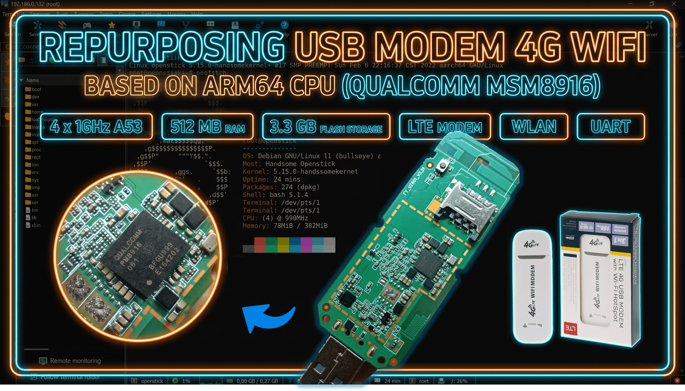
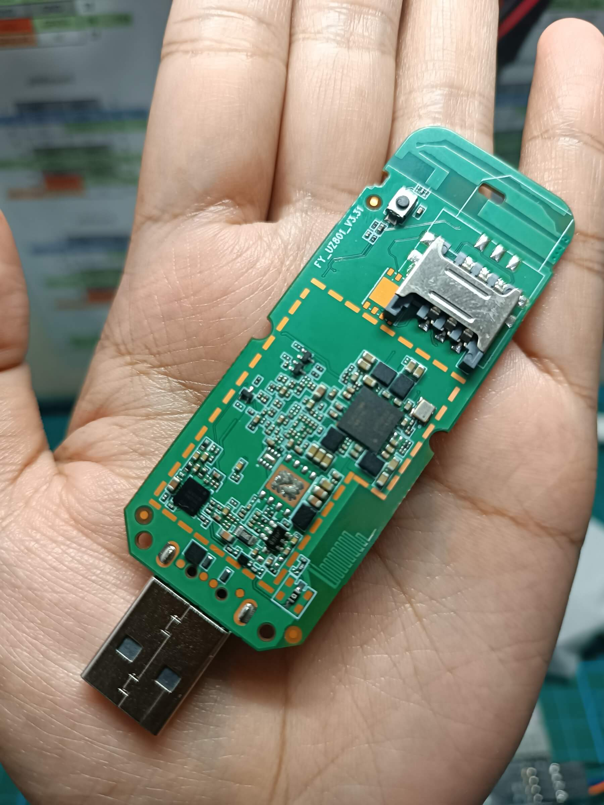

# OpenStick — Repurposing USB Modem 4G (Qualcomm MSM8916) As Linux Device

  
  
  
  
  

<i>Repurpose your USB modem 4G Wi-Fi device, based on the Qualcomm MSM8916 chipset, into a fully functional Linux device — 4× Cortex-A53 ARM64, Debian, SSH, WiFi, and more.</i>

The UZ801, commonly known as the OpenStick, is a compact USB modem 4G with built-in Wi-Fi based on the Qualcomm Snapdragon 410 (MSM8916) System on Chip. Out of the box, it ships with Android as its operating system and functions primarily as a mobile hotspot and 4G LTE USB modem. However, thanks to the unlocked bootloader and community-driven efforts, this device can be repurposed into a fully functional Linux-powered embedded computer — running Debian on ARM64 with SSH, WiFi, and full root access. This project documents the complete process of flashing Linux onto the OpenStick, turning it from a simple USB modem into a powerful low-cost development and IoT device.

## Hardware Specifications
<table style="border: none; border-collapse: collapse;">
  <tr>
    <td >
      <table>
        <tr><td><strong>SoC</strong></td><td>Qualcomm Snapdragon 410 (MSM8916)</td></tr>
        <tr><td><strong>CPU</strong></td><td>4 × Cortex-A53 @ 1 GHz (ARM64 / aarch64)</td></tr>
        <tr><td><strong>RAM</strong></td><td>512 MB LPDDR3</td></tr>
        <tr><td><strong>Storage</strong></td><td>~3.3 GB eMMC</td></tr>
        <tr><td><strong>WiFi</strong></td><td>802.11 b/g/n (2.4 GHz)</td></tr>
        <tr><td><strong>4G LTE</strong></td><td>Yes — USB modem with RNDIS network interface</td></tr>
        <tr><td><strong>USB</strong></td><td>USB 2.0 OTG (used for flashing + ADB)</td></tr>
        <tr><td><strong>Bootloader</strong></td><td>lk2nd (modified, unlocked)</td></tr>
        <tr><td><strong>Kernel</strong></td><td>Linux 5.15.0-handsomekernel (mainline)</td></tr>
        <tr><td><strong>Default OS</strong></td><td>Android (pre-installed)</td></tr>
      </table>
    </td>
    <td align="left" style="vertical-align: top;"></td>
  </tr>
</table>

## Installation (Windows + WSL)

Full installation guide for flashing Debian Linux onto the OpenStick via Windows Subsystem for Linux (WSL2):

👉 [OPENSTICK_INSTALLATION_WSL_HOW_TO.md](OPENSTICK_INSTALLATION_WSL_HOW_TO.md)

## Credits

This would not be possible without the original work by **HandsomeYingYan**, who unlocked the bootloader, modded the lk2nd bootloader, patched the Linux kernel source, and documented the entire flashing process in Chinese.

The English-language guide that made this accessible to a wider audience was published at:

https://extrowerk.com/2022-07-31/OpenStick.html
